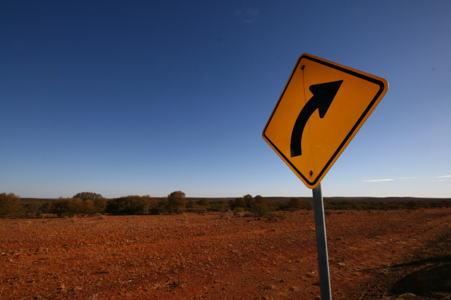

gimp_plugins
============

Put the corresponding file into 
``~/.gimp-2.8/plug-ins/`` to enable a Plug-in per user
or into ``/usr/lib/gimp/2.0/plug-ins/`` to enable it globally.
Path names may vary dedenging on OS and GIMP version.

freecrop
--------

This rather trivial Plug-in is useful for fast and easy extraction
of a lot of non-rectangular parts of images (assign a hotkey ;)).

The Image will be cropped to the **selection**, all pixels not selected will
be set transparent and the resulting image will be saved under a random name as PNG.

You will find the Plug-in in the 'File' menu.

input | output
------ | ------
 | 
